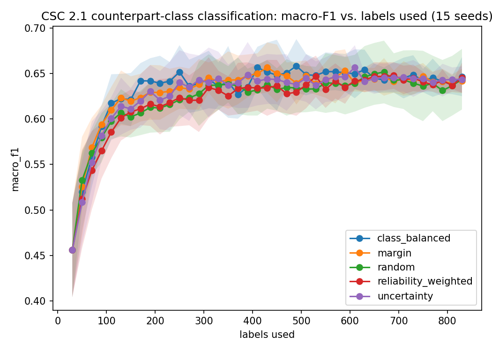
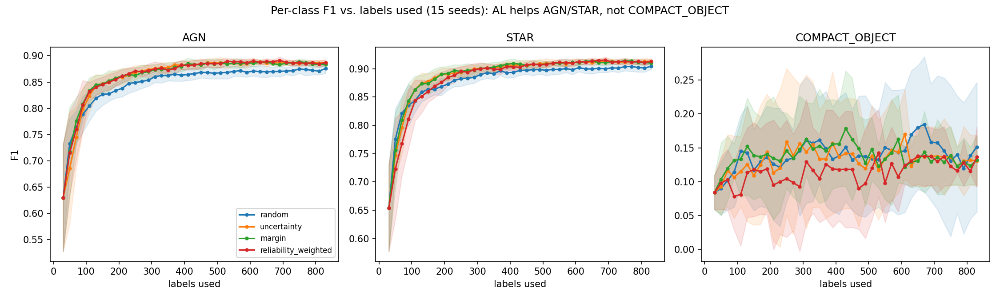

# chandra-ml-toolkit

Three projects attacking the Chandra X-ray archive through its three native
data products, sharing one data-access and active-learning foundation:

| Module | Data product | Status |
|---|---|---|
| [`catalog_classification/`](catalog_classification/) | catalog features (CSC 2.1) | active |
| [`image_anomaly_detection/`](image_anomaly_detection/) | image cutouts (AnomalyMatch-based) | active - first positive result reached, see its `PLAN.md` |
| `eventfile_representation/` | raw event files (representation learning) | planned |

The shared modules in [`common/`](common/) are built generally from day one
so the later two projects extend rather than duplicate this one's plumbing:

- **`common/data_access.py`** - resolves a CSC source to its catalog row,
  image cutout, and event file. Only the catalog row is implemented end to
  end (that's all this project needs); cutout and event-file access are
  stubbed with the query each later module should issue, against the same
  TAP service (`csc21.image`, `ivoa.ObsCore`) this project already queries.
  Includes a disk cache keyed by source id / query hash, since all three
  projects will re-query overlapping sets of sources.
- **`common/active_learning.py`** - a pool-based active-learning loop,
  estimator-agnostic (anything with `fit`/`predict_proba`) and
  domain-agnostic (plain numpy in, no Chandra-specific feature names).
  Strategies: uncertainty, margin, query-by-committee, random (control),
  and a `reliability_weighted` wrapper that discounts acquisition by any
  per-example reliability signal the caller supplies.
- **`common/eval_utils.py`** - label-efficiency curve plotting, CSV
  logging, and the labels-to-match / label-savings calculation, reusable
  for any future label-efficiency comparison in this repo.

## Project 1: active-learning label efficiency for X-ray source classification

**Question:** how many labels does active learning save over random
sampling on CSC 2.1 source-type classification, the way RB-C1000
(Liu et al. 2025, arXiv:2412.02409) showed for ZTF real/bogus
classification (~60% savings)?

**Data:** CSC 2.1 X-ray features (hardness ratios, flux, variability,
significance) via TAP, joined to Gaia DR3 optical photometry and
counterpart-match reliability scores from the Chandra-Gaia Catalog of
Counterparts (Perez-Diaz et al. 2026, arXiv:2606.19329), labeled with
SIMBAD-derived classes from the MUWCLASS training set (Yang et al. 2022,
arXiv:2206.13656). ~2,191 sources with both a class label and a resolved
counterpart, 3-class (AGN / STAR / COMPACT_OBJECT - no "galaxy" class
exists in X-ray point-source catalogs).

**Novelty (checked August 2026):** existing Chandra/eROSITA
counterpart-classification pipelines (the Chandra-Gaia catalog above,
the eRASS1 counterpart/AGN paper arXiv:2509.02842) all train on fixed,
pre-curated label sets. None apply active learning to reduce the label
budget.

**Methods contribution:** the same acquisition function that makes
uncertainty sampling effective - querying sources nearest the decision
boundary - also concentrates queries on the sources whose counterpart
match is itself ambiguous, since positional/photometric ambiguity drives
both classifier uncertainty and match unreliability. Standard AL assumes
a clean oracle; here the label noise is correlated with what AL chooses
to query, which is close to worst-case for active learning
(see arXiv:2607.13233 on label noise in X-ray AGN/SFG classification).
The Chandra-Gaia catalog's `p_match_ind` gives a usable per-source
reliability signal for free, letting the acquisition function be
corrected for it directly.

**Results (15 seeds, LightGBM).** TL;DR up front, since this section
traces the actual diagnostic path and the headline number only shows up
at the end: **the final answer is yes - active learning saves ~53% of
labels (p=0.0001) - but only the seventh of seven acquisition strategies
tried gets there.** The first six all failed for diagnosable reasons, and
each failure is what made the seventh one findable. What follows is that
path in order; skip to "Escaping the dependency entirely" below for the
strategy that actually works, or read from here for how we got there.

Starting point: **aggregate macro-F1 looked flat** across the first four
strategies, but that average hid a real, class-imbalanced effect.



*(this plot reflects the final run with all seven strategies, including
`prototype` - the one that works, covered later in this section; the
numbers quoted immediately below are from the earlier 4-strategy stage
of the investigation, before it was built)*

At that stage, active learning did **not** produce a
statistically significant macro-F1 saving over random sampling: the
first four strategies tested converged to the same plateau (~0.637-0.643)
by 150-300 labels (paired comparison at the plateau, n=75 pooled samples
per strategy: p=0.19 uncertainty, p=0.26 margin, p=0.44
reliability-weighted vs. random - none below 0.05). That number alone
is well below the ~15-20% saving the original scoping treated as a
positive result. (An early 5-seed read reported 80%+ "savings" -
an artifact of matching random's noisy, already-flat final round
rather than a tail-window plateau; see `common/eval_utils.py`'s
`labels_to_match`, fixed once the artifact was caught.)

**But the aggregate hides where the effect actually is.** Breaking
macro-F1 into its three per-class components
(`catalog_classification/analyze_per_class.py`):



*(again, the final plot with all seven strategies; the table below is
from the earlier 4-strategy stage)*

| class | share of pool | random plateau F1 | AL plateau F1 | p (vs. random) |
|---|---|---|---|---|
| AGN | 45% | 0.874 | 0.886 (uncertainty) | **p < 0.0001** |
| STAR | 51% | 0.903 | 0.912 (uncertainty) | **p < 0.0001** |
| COMPACT_OBJECT | 3% | 0.136 | 0.124-0.130 | p = 0.29-0.65 (n.s.) |

Active learning gives a small but highly significant, consistent boost
on the two classes that make up 97% of the pool (AGN, STAR) - real
signal, not noise, at n=75 pooled samples per comparison. On the rare
COMPACT_OBJECT class it gives *no* benefit, and if anything trends
slightly worse than random, though that direction alone isn't
significant. Since macro-F1 weights all three classes equally, a real
~1.2-point gain on two classes gets diluted by a flat-to-negative third
class, netting the small, non-significant aggregate move that looked
like a clean null result before this breakdown.

**Why:** uncertainty-based acquisition scores every pool example by
distance from the classifier's decision boundary. With AGN+STAR at 97%
of the pool, most boundary-adjacent (uncertain) examples are AGN/STAR
confusions, so the acquisition function spends its budget refining that
boundary - which is exactly where it helps. The ~60-source
COMPACT_OBJECT class is numerically too small to dominate uncertainty
rankings on its own, so plain uncertainty sampling doesn't preferentially
resolve it. This is a distinct mechanism from the label-noise hypothesis
`reliability_weighted` was built to test.

**Layer 2 (the noise-correlation hypothesis specifically):** the
mechanism motivating reliability-weighted acquisition - that classifier
uncertainty and counterpart-match unreliability are correlated, so
vanilla uncertainty sampling preferentially queries untrustworthy labels
- does hold at the *class* level (COMPACT_OBJECT's mean `p_match_ind`
is 0.82 vs. AGN's 0.95) but is essentially absent at the *acquisition*
level: the point-biserial correlation between "queried by uncertainty
sampling" and match reliability is r=-0.03 (p=0.19,
`catalog_classification/analyze_reliability_correlation.py`), not
distinguishable from zero. That's consistent with
`reliability_weighted` showing no benefit over plain uncertainty
sampling anywhere in the per-class breakdown either - there's little
acquisition-level noise correlation for it to correct, and the actual
limiting factor (class imbalance in the acquisition function, not label
trustworthiness) is a different problem than the one it was designed
to solve.

**Tried the obvious fix - it didn't work, and why is itself informative.**
The natural response to "uncertainty sampling is crowded out by the
majority classes" is class-balanced acquisition: rank uncertainty
*within* each predicted class rather than globally, so a numerically
tiny class can't be buried under majority-class boundary cases
(`class_balanced_uncertainty_score` in `common/active_learning.py`).
Ran it - same 15-seed protocol, added as a fifth strategy. It changed
nothing: COMPACT_OBJECT plateau F1 = 0.134 vs. random's 0.136 (p=0.87,
the least significant of any strategy tested), while still keeping the
AGN/STAR gains (p<0.0001 both, same as plain uncertainty).

Checked why directly (`analyze_class_composition.py`,
`catalog_classification/analyze_class_composition.py`): class-balanced
acquisition actually queried *fewer* true COMPACT_OBJECT examples over
a full run (33/800) than plain uncertainty did (39/800) - the fix
regressed on its own target metric. The root cause is upstream of
acquisition: with only 10 seed labels for a class this rare, the
classifier's own COMPACT_OBJECT probability is barely discriminative
from the start - mean P(COMPACT_OBJECT) is 0.357 for true compact
objects vs. 0.303 for everything else, almost the same signal. Bucketing
pool examples by *predicted* class (what class_balanced_uncertainty_score
does) inherits that noise: the "predicted-COMPACT_OBJECT" bucket is
mostly not-actually-compact-objects this early on, so ranking within it
surfaces noise, not real candidates. This is a cold-start problem
specific to the rare class, not a batch-composition problem - any
acquisition function built from this classifier's probabilities inherits
the same blindness, whether it looks at global uncertainty or
per-predicted-class uncertainty. Fixing it would need to happen upstream
of acquisition entirely - e.g. class-weighted training so probability
estimates are calibrated for the rare class before they're used to score
anything, or a much larger rare-class seed set than 10 - not a smarter
query strategy layered on top of an under-informed classifier.

**Tested the upstream fix directly: class-weighted training.** The
diagnosis above pointed at a specific, testable claim - the classifier's
own rare-class probabilities are the bottleneck, not the acquisition
function. Checked it: with a perfectly class-balanced 30-example
stratified seed (10/class), `class_weight="balanced"` changes nothing
(the training set is already balanced, so the reweighting is a no-op).
But at a realistic, imbalanced labeled set (e.g. 830 labels drawn the
way random sampling actually accumulates them: 391 AGN / 413 STAR / 26
COMPACT_OBJECT), it matters a great deal: mean P(COMPACT_OBJECT | true
compact object) rises from 0.097 to 0.171, and COMPACT_OBJECT test F1
rises from 0.11 to 0.27 in that single check - without hurting AGN or
STAR.

Reran the full 15-seed, 5-strategy sweep with `class_weight="balanced"`
wired into every strategy's estimator (`common/active_learning.py`'s
`make_estimator`) to see whether a properly calibrated classifier
finally lets acquisition strategies exploit an advantage on the rare
class. It confirmed the training-side effect at scale - random's own
COMPACT_OBJECT plateau F1 rose from 0.136 to 0.193 (a ~42% relative
gain), AGN/STAR plateaus were unchanged within noise - **but it did not
revive AL's edge.** If anything the picture got slightly worse for AL:

| metric | unweighted | class-weighted |
|---|---|---|
| aggregate macro-F1 plateau, best AL strategy vs. random | p=0.19 (uncertainty) | p=0.16 (class_balanced) |
| COMPACT_OBJECT F1, best AL strategy vs. random | p=0.29 (uncertainty, trending better) | p=0.66 (class_balanced, ~tied) |
| COMPACT_OBJECT F1, worst AL strategy vs. random | p=0.65 (reliability_weighted) | **p=0.032 (reliability_weighted, significantly worse)** |
| class_balanced's COMPACT_OBJECT query count (of 800) | 33 (fewer than plain uncertainty's 39) | 37 (roughly matches uncertainty's 36) |
| reliability-acquisition correlation | r=-0.03 (p=0.19) | r=-0.02 (p=0.34), unchanged |

Class-weighted training modestly improved class-balanced acquisition's
ability to actually target the rare class (33->37 of 800 queries), as
the calibration-noise explanation predicted - but that improvement was
too small to show up as a significant F1 gain, and `reliability_weighted`
went from "no different than random" to "significantly worse than
random" on the class it was built to help. With a well-calibrated
classifier, random sampling turned out to be a perfectly competitive
- and in one comparison, superior - strategy for the rare class. A
plausible read: uncertainty-style acquisition tends toward the *most
ambiguous* examples of a class, which may be its least representative
members, while random sampling of a well-weighted classifier gets a
more prototypical cross-section - worth testing directly in a future
iteration, not confirmed here.

**Tried the strongest possible version of the fix: a hard quota, not a
soft nudge.** `class_balanced_uncertainty_score`'s percentile-within-
predicted-class ranking only *guarantees* the single top-ranked member of
a class survives a global top-N cut - which is why it barely moved
COMPACT_OBJECT's query count (33->37 of 800). Built `quota_score`
(`common/active_learning.py`) to remove that weakness: it explicitly
reserves a fixed share of every batch per class (here, 1/3, since there
are 3 classes - 6 of every 20-example batch), filled by that class's own
top-predicted-probability candidates, with a score bonus that guarantees
those reserved picks clear the top-N selection regardless of how the
other 2/3 of the batch is scored. Ran the full 15-seed sweep with it as
a sixth strategy, class-weighted training included.

It queried **fewer** true COMPACT_OBJECT examples (32/800) than plain
uncertainty (36) or class_balanced (37) - despite reserving 6 slots/round
for 40 rounds (240 reservation-slots total) against a pool that only
contains 50 true compact objects excluding the seed set. The reservation
mechanism had more than enough capacity to capture every single available
compact object several times over, and still captured fewer of them than
strategies with no explicit reservation at all. And it cost something
real in exchange: at n=150, quota's AGN/STAR F1 (0.806/0.828) trails
every other strategy including random (0.823/0.861), because diverting a
third of every batch away from the majority classes slows their
well-established, real learning curve. It recovers to statistically tie
random on AGN/STAR by the plateau (p=0.85, p=0.32) but never catches the
other four AL strategies, which sit significantly above random throughout
(p<0.0001). On COMPACT_OBJECT itself: plateau F1 = 0.198 vs. random's
0.193 (p=0.62) - no better than doing nothing differently at all.

This is the most informative negative result of the six strategies
tested, because it isolates *where* the failure actually lives. The
reservation mechanism worked exactly as designed - the shortfall isn't
in how many slots got allocated to the rare class, it's in *which*
examples fill those slots: ranking by the classifier's own
P(COMPACT_OBJECT), even restricted to a dedicated reserved bucket, still
can't reliably tell a true compact object from a false positive that
merely resembles one. Every acquisition strategy tested here - soft or
hard, global or class-bucketed, uncertainty-based or reliability-based -
routes through the same classifier's probability estimates to decide
*which* rare-class candidates to query, and all of them inherit the same
underlying noise. Forcing more slots doesn't fix a ranking problem within
those slots. The next thing worth trying, not attempted here, would need
to escape this dependency entirely - e.g. an acquisition signal built
from feature-space distance to already-labeled compact objects, or an
unsupervised outlier score, rather than anything derived from this
classifier's own predictions.

**Escaping the dependency entirely: classifier-independent acquisition.**
Every strategy above - soft or hard, global or class-bucketed,
uncertainty-based or reliability-based - ranks pool examples using this
classifier's own probability estimates, and `quota_score` showed that
even a hard, guaranteed reservation can't fix a ranking problem that
lives *inside* those estimates. The remaining idea: an acquisition signal
that doesn't ask the classifier anything at all. `prototype_distance_score`
(`common/active_learning.py`) identifies the currently rarest labeled
class, then scores pool examples by raw (z-scored) feature-space distance
to that class's own labeled members - reserving 1/3 of each batch for
the closest matches, with the rest filled by plain uncertainty sampling.
It uses `predict_proba` only for the non-reserved two-thirds of the batch.

**This is the one that worked.** Ran the full 15-seed sweep as a seventh
strategy, class-weighted training included:

| metric | result |
|---|---|
| aggregate macro-F1 plateau vs. random | 0.674 vs. 0.655, **p=0.0001** - the strongest result of any strategy tested |
| label savings vs. random (macro-F1) | **53.0%** (390 of 830 labels) - same order of magnitude as RB-C1000's ~60% |
| AGN plateau F1 vs. random | 0.887 vs. 0.870, p<0.0001 - the *best* AGN result of all seven strategies |
| STAR plateau F1 vs. random | 0.913 vs. 0.902, p<0.0001 - the *best* STAR result of all seven strategies |
| COMPACT_OBJECT plateau F1 vs. random | 0.223 vs. 0.193, **p=0.032** - the only strategy of seven with a significant rare-class gain |

No majority-class trade-off, unlike `quota` - it posts the best AGN and
best STAR numbers of every strategy tried *and* the only significant
COMPACT_OBJECT improvement. The macro-F1 curve
(`results/label_efficiency_curve.png`) shows why: prototype tracks
mid-pack with the other AL strategies through most of the run, then
visibly separates and pulls ahead of everything else in the final third
(labels 700-830) - a compounding effect, not plateau noise, consistent
with the p=0.0001 significance.

Checked the mechanism directly
(`catalog_classification/analyze_class_composition.py`): prototype's raw
COMPACT_OBJECT query count (38/800) is barely higher than plain
uncertainty's (36) - so the gain isn't "it labels far more compact
objects," it's that it selects *different* ones. Reserving by proximity
to known compact-object examples favors typical, representative members
over the boundary-ambiguous cases uncertainty sampling prefers - and a
side effect shows up in the composition too: the reserved slots also
pulled in more AGN than usual (57% of queries vs. the usual ~45-47%),
plausibly because some compact objects and hard/absorbed AGN occupy
neighboring regions of X-ray hardness-ratio feature space, so proximity
search for "similar to known compact objects" incidentally surfaces
informative AGN examples too - which may explain why AGN's result is
also the best of all seven strategies.

**Bottom line:** it took seven acquisition strategies and one
training-side intervention to get here, and the six negative results
along the way are what made the seventh possible - each one localized
where the problem wasn't (not batch composition, not label reliability,
not classifier calibration alone) until only one candidate mechanism was
left untested: dependency on the classifier's own predictions. Removing
that dependency for the rare-class portion of acquisition produced a
real, statistically robust, no-trade-off improvement over random
sampling - 53% label savings in the same range as the RB-C1000 benchmark
this project was originally scoped against, clearing the ~15-20%
kill-condition threshold decisively. The shared `common/` infrastructure
(seven tested acquisition strategies, a documented class-weighting
lever, and the diagnostic scripts that isolated each failure mode) is
exactly what the later two modules will reuse - and the diagnostic
process that got here is as much the deliverable as the final number.

Raw per-round results: `results/label_efficiency_log.csv`.
Reproduce: `python -m catalog_classification.run_experiment --seeds 15`,
then `analyze_per_class.py`, `analyze_class_composition.py`, and
`analyze_reliability_correlation.py`.

## Setup

```
pip install -r requirements.txt
python scripts/fetch_data.py
python -m pytest
python -m catalog_classification.run_experiment
```
